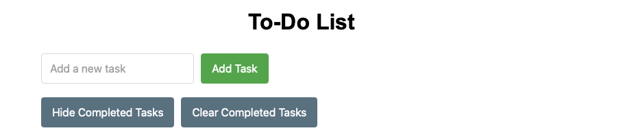

# LocalTodoList

A barebones to-do list Flask webapp. No javascript, just HTML and CSS.

Intended for secure local deployments. 

`pip install -r requirements.txt`

Run the app fully locally:

`flask run`

Run the app visible over local network:

`flask run --host 0.0.0.0 --port 8888`

Change the port number as desired.

Tasks are stored in a local file `tasks.txt` and cleared completed tasks are stored in `done-tasks.txt`

### Disclaimer

This open source software is provided "as is", without warranty of any kind, 
express or implied, including but not limited to the warranties of merchantability, 
fitness for a particular purpose and noninfringement. In no event shall the authors 
or copyright holders be liable for any claim, damages or other liability, whether in an 
action of contract, tort or otherwise, arising from, out of or in connection with the 
software or the use or other dealings in the software.

The authors and maintainers of this code provide no support, maintenance, or 
guarantee of functionality. Users implement and use this code entirely at their own risk.

